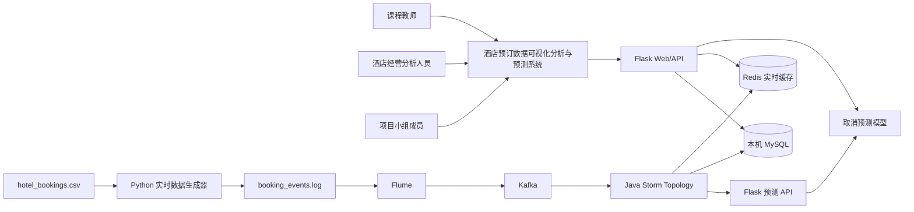
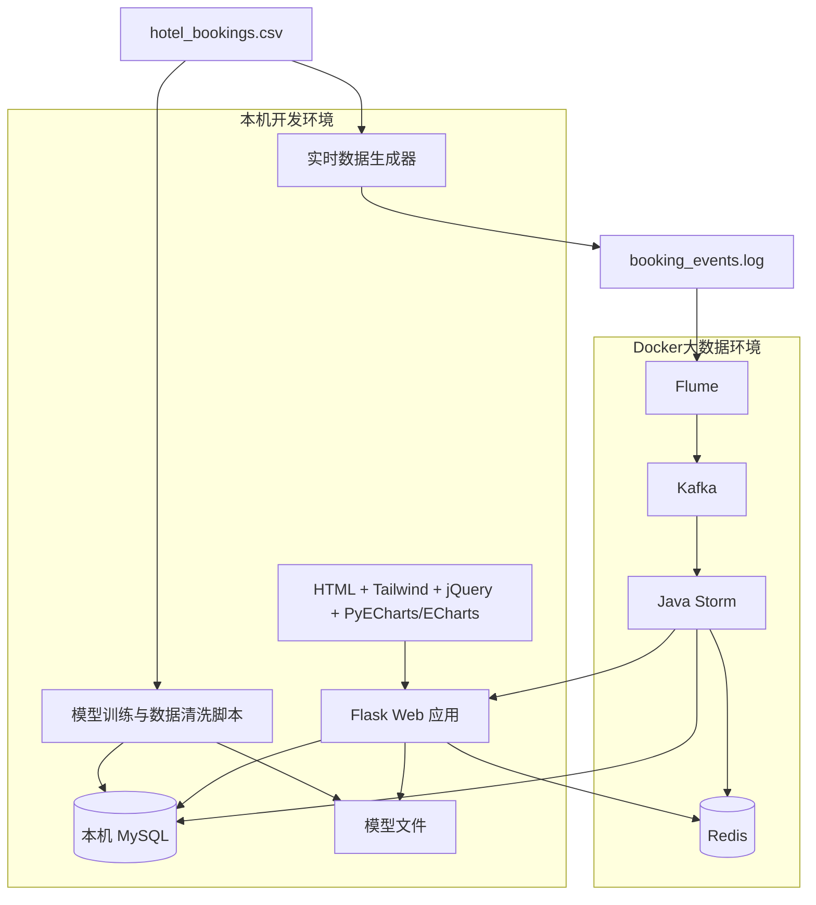

# 酒店预订数据可视化分析与预测系统规划设计说明书

## 一、设计目标

本说明书在《需求分析说明书》的基础上，对“酒店预订数据可视化分析与预测系统”进行系统规划设计。设计重点包括总体架构、模块划分、数据流、MySQL 与 Redis 存储设计、接口设计、页面设计、Flume/Kafka/Java Storm 实时链路、模型调用方式、图表交互规则和测试计划。

系统采用 B/S 架构，后端使用 Flask，前端使用 HTML、Tailwind、jQuery 与 PyECharts / ECharts，历史与持久化数据使用本机 MySQL，实时缓存使用 Redis，大数据流处理组件 Flume、Kafka、Java Storm、Redis 使用 Docker Compose 部署。机器学习模型由离线训练脚本生成，Flask 负责加载模型并提供预测 API；Java Storm Topology 在实时处理过程中消费 Kafka 事件、调用 Flask 预测 API、计算实时指标，并将结果写入 MySQL 与 Redis。

设计主线统一为：以酒店预订取消率预测为核心，数据查询体现 MySQL 操作，数据可视化自然覆盖课本五类“时间、关系、比例、文本、复杂数据可视化”，实时链路体现 Flume/Kafka/Java Storm/Redis 的真实整合。

## 二、总体架构设计

### 2.1 架构分层

系统分为五层：

1. 数据源层：`hotel_bookings.csv`、模拟实时预订事件日志 `booking_events.log`。
2. 数据处理层：数据清洗脚本、特征工程脚本、模型训练脚本、实时数据生成器。
3. 大数据流处理层：Flume、Kafka、Java Storm Topology、Redis。
4. 服务与算法层：Flask API、机器学习模型推理、MySQL 数据访问、Redis 数据访问。
5. 表现层：首页、数据查询、数据可视化、评估与预测页面，以及 PyECharts / ECharts 图表。

### 2.2 系统上下文图



### 2.3 容器与本机部署架构



### 2.4 技术职责边界

| 组件 | 职责 |
|---|---|
| Flask | 页面路由、数据接口、预测 API、MySQL/Redis 读取、模型加载 |
| MySQL | 历史数据、查询数据、模型评估、预测结果、实时指标快照持久化 |
| Redis | 最新实时指标、最近预测记录、实时趋势增量、地图/渠道风险缓存、链路状态 |
| Flume | 监听模拟业务日志 `booking_events.log` 并发送到 Kafka |
| Kafka | 缓冲实时预订事件，解耦 Flume 与 Storm |
| Java Storm | 消费 Kafka 事件，调用 Flask 预测 API，计算窗口指标，写 MySQL 和 Redis |
| PyECharts/ECharts | 渲染历史图表、交互图表、模型评估图和实时增量图 |
| Scikit-learn | 训练逻辑回归和随机森林分类器，输出模型指标和模型文件 |

## 三、核心数据流设计

### 3.1 历史数据链路

```text
hotel_bookings.csv
  ↓
数据清洗脚本
  ↓
字段处理与特征工程
  ↓
hotel_bookings 表
  ↓
数据查询 API / 可视化 API / 模型训练脚本
  ↓
数据查询页面 / 数据可视化页面 / 评估与预测页面
```

历史数据用于：数据查询与 CRUD 演示、取消率历史分析、课本五类可视化图表构建、模型训练和模型评估、实时模拟事件的 `booking_id` 来源。

### 3.2 模型训练链路

```text
hotel_bookings 表或 CSV
  ↓
特征工程
  ↓
训练逻辑回归和随机森林分类器
  ↓
评估 Accuracy / Precision / Recall / F1 / AUC
  ↓
写入 model_metrics 表
  ↓
保存最终模型文件
  ↓
Flask 模型服务加载并提供预测 API
```

模型训练阶段不放入 Storm。Storm 只在实时链路中通过 HTTP 调用 Flask 预测 API，不直接加载 Python `.pkl` 模型文件。

### 3.3 实时流处理链路

```text
hotel_bookings.csv
  ↓
Python 实时数据生成器按 event_date 顺序逐行读取
  ↓
按压缩比例生成 send_time，并持续追加 booking_events.log
  ↓
Flume 监听日志文件
  ↓
Kafka 接收预订事件
  ↓
Java Storm Topology 消费 Kafka 事件
  ├── 调用 Flask 预测 API，预测结果写入 MySQL
  ├── 计算实时聚合指标，指标快照写入 MySQL
  └── 最新指标 / 最近预测 / 增量序列写入 Redis
  ↓
Flask API 查询 MySQL + Redis
  ↓
PyECharts / ECharts 数据可视化页面展示
```

本项目中 Flume 采集模拟业务事件日志，不采集 MySQL binlog。真实业务中如需采集 MySQL 订单变化，一般使用 CDC/binlog 工具，本项目不实现该部分。Redis 不替代 Kafka，而是作为 Storm 下游实时缓存层，服务实时可视化和增量更新。

## 四、模块划分设计

### 4.1 数据与算法模块

职责：读取 `hotel_bookings.csv`，完成数据清洗、缺失值处理、时间字段构造、特征工程、逻辑回归与随机森林分类器训练、模型评估、最终模型保存和 `model_metrics` 写入。

建议文件：

```text
数据处理/数据清洗.py
数据处理/数据导入.py
数据处理/数据探索.py
模型训练/训练模型.py
模型训练/评估模型.py
模型训练/模型文件/
```

### 4.2 后端服务模块

职责：Flask 应用入口、页面路由、数据查询 CRUD API、数据可视化 API、预测 API、模型评估 API、实时指标 API、MySQL 连接封装和 Redis 连接封装。

建议文件：

```text
后端服务/应用入口.py
后端服务/配置.py
后端服务/MySQL数据库.py
后端服务/Redis缓存.py
后端服务/模型服务.py
后端服务/接口/数据查询接口.py
后端服务/接口/可视化接口.py
后端服务/接口/预测接口.py
后端服务/接口/实时指标接口.py
```

### 4.3 前端可视化模块

职责：页面布局、数据查询页面、数据可视化页面、图表交互联动、评估与预测页面、实时风险监控、调用 Flask API 并渲染 PyECharts / ECharts 图表。

建议文件：

```text
前端页面/模板/首页.html
前端页面/模板/数据查询.html
前端页面/模板/数据可视化.html
前端页面/模板/评估与预测.html
前端页面/静态资源/脚本/图表渲染.js
前端页面/静态资源/脚本/图表联动.js
前端页面/静态资源/样式/页面样式.css
```

### 4.4 大数据实时链路模块

职责：Docker Compose 编排 Flume、Kafka、Java Storm、Redis；Python 脚本模拟实时预订事件；Flume 采集日志；Kafka 缓冲事件；Java Storm 消费事件、调用 Flask 预测 API、写入 MySQL 与 Redis。

建议文件：

```text
实时链路/Docker编排.yml
实时链路/Flume配置.conf
实时链路/实时数据生成器.py
实时链路/事件日志/booking_events.log
实时链路/Storm拓扑/pom.xml
实时链路/Storm拓扑/src/main/java/com/hotel/storm/HotelBookingTopology.java
实时链路/Storm拓扑/src/main/java/com/hotel/storm/bolt/EventParseBolt.java
实时链路/Storm拓扑/src/main/java/com/hotel/storm/bolt/PredictRequestBolt.java
实时链路/Storm拓扑/src/main/java/com/hotel/storm/bolt/MySQLWriteBolt.java
实时链路/Storm拓扑/src/main/java/com/hotel/storm/bolt/RedisMetricBolt.java
```

### 4.5 数据库与缓存模块

职责：创建 MySQL 数据库与数据表、初始化基础数据、设计 Redis Key、提供 SQL 脚本和 Redis 说明。

建议文件：

```text
数据库/建库建表.sql
数据库/初始化数据.py
数据库/查询示例.sql
数据库/Redis键设计.md
```

## 五、MySQL 与 Redis 设计

### 5.1 MySQL 数据库名称

```text
hotel_booking_analysis
```

字符集：`utf8mb4`。

### 5.2 `hotel_bookings` 表

用途：保存 CSV 历史导入数据，用于数据查询、历史分析、模型训练、模型评估和实时模拟事件引用。

核心字段包括：`booking_id`、`hotel`、`is_canceled`、`lead_time`、`arrival_date`、`event_date`、`country`、`country_name`、`market_segment`、`customer_type`、`deposit_type`、`adr`、`reservation_status`、`reservation_status_date`、`is_deleted`、`created_at`、`updated_at` 等。

### 5.3 `prediction_results` 表

用途：保存单条预订取消预测结果。

| 字段名 | 类型 | 说明 |
|---|---|---|
| prediction_id | BIGINT 主键 | 预测结果 ID |
| booking_id | BIGINT | 关联 `hotel_bookings.booking_id` |
| model_version | VARCHAR(50) | 模型版本 |
| cancel_probability | DECIMAL(6,4) | 取消概率 |
| predicted_label | TINYINT | 预测标签 |
| risk_level | VARCHAR(20) | 风险等级 |
| source | VARCHAR(30) | 来源：form 或 storm |
| predicted_at | DATETIME | 预测时间 |

### 5.4 `realtime_metrics` 表

用途：保存 Java Storm 生成的实时聚合指标快照，用于持久化和报告展示。

| 字段名 | 类型 | 说明 |
|---|---|---|
| metric_id | BIGINT 主键 | 指标 ID |
| metric_name | VARCHAR(100) | 指标名称 |
| metric_value | VARCHAR(100) | 指标值 |
| metric_type | VARCHAR(50) | 指标类型 |
| window_start | DATETIME | 窗口开始时间 |
| window_end | DATETIME | 窗口结束时间 |
| updated_at | DATETIME | 更新时间 |

### 5.5 `model_metrics` 表

用途：保存逻辑回归、随机森林等候选模型的整体评估结果，包括 Accuracy、Precision、Recall、F1、AUC、训练集规模、测试集规模、是否选中、模型文件路径和模型说明。

### 5.6 Redis Key 设计

| Key | 类型 | 写入方 | 读取方 | 用途 |
|---|---|---|---|---|
| `realtime:summary` | Hash | Java Storm | Flask | 最新核心指标，如处理量、高风险数、平均取消概率 |
| `realtime:trend` | List / Stream | Java Storm | Flask | 实时趋势增量点，用于前端追加折线图 |
| `realtime:recent_predictions` | List | Java Storm | Flask | 最近预测记录，用于高风险订单滚动表 |
| `realtime:country_risk` | Hash / Sorted Set | Java Storm | Flask | 国家维度实时取消风险，用于地图联动 |
| `realtime:channel_risk` | Hash / Sorted Set | Java Storm | Flask | 渠道维度实时取消风险 Top |
| `realtime:customer_type_risk` | Hash | Java Storm | Flask | 客户类型维度实时取消风险 |
| `realtime:link_status` | Hash | Java Storm / 后端 | Flask | Flume/Kafka/Storm/Redis 链路状态 |

Redis 数据以实时展示为主，允许设置合理过期时间；MySQL 数据以持久化和报告复核为主，不依赖 Redis 保存长期历史。

## 六、接口设计

### 6.1 页面路由接口

| 页面 | 路径 | 模板 | 用途 |
|---|---|---|---|
| 首页 | `/` | `首页.html` | 系统总览、核心指标、链路概览 |
| 数据查询 | `/数据查询` | `数据查询.html` | MySQL 检索、新增、修改、逻辑删除 |
| 数据可视化 | `/数据可视化` | `数据可视化.html` | 取消率相关图表、地图交互、实时风险监控 |
| 评估与预测 | `/评估与预测` | `评估与预测.html` | 模型训练过程、模型评估、单条预测 |

### 6.2 核心数据接口

| 接口 | 方法 | 数据源 | 用途 |
|---|---|---|---|
| `/api/历史概览` | GET | MySQL | 首页核心指标 |
| `/api/bookings/query` | GET | MySQL | 查询预订记录 |
| `/api/bookings/create` | POST | MySQL | 新增预订记录 |
| `/api/bookings/update` | POST | MySQL | 修改预订记录 |
| `/api/bookings/delete` | POST | MySQL | 逻辑删除预订记录 |
| `/api/visual/trend` | GET | MySQL | 取消趋势分析 |
| `/api/visual/factors` | GET | MySQL | 取消因素分析 |
| `/api/visual/customer_channel` | GET | MySQL | 客户与渠道分析 |
| `/api/visual/country_map` | GET | MySQL + Redis | 地区交互分析 |
| `/api/visual/realtime` | GET | Redis + MySQL | 实时风险监控 |
| `/api/模型评估` | GET | MySQL | 模型评估结果 |
| `/api/取消预测` | POST | 模型 + MySQL | 单条预测并写入结果 |
| `/api/最新预测结果` | GET | Redis + MySQL | 最近预测记录 |
| `/api/实时指标` | GET | Redis + MySQL | 最新实时指标 |

### 6.3 图表联动接口规则

前端点击图表后，将点击维度转换为统一筛选条件，重新请求相关接口。

典型联动：

- 点击地图国家 → 更新国家详情指标卡、国家渠道取消率图、国家客户类型图、高风险订单表。
- 点击月份 → 更新地图、渠道图、客户类型图、订单明细表。
- 点击渠道 → 更新取消率趋势、客户类型、地图和订单明细。
- 点击词云标签 → 更新相关风险指标和订单明细。

## 七、页面设计

### 7.1 页面设计总则

页面采用课程 Web 应用风格，保留老师示例中的“顶部导航 + 页面主体 + 图表区域”结构，同时吸收深色科技风数据看板的视觉表现。统一导航为：首页、数据查询、数据可视化、评估与预测。

### 7.2 首页

模块包括：项目标题区、核心指标卡片、数据处理概览、实时摘要卡片、技术链路概览、功能导航区。

### 7.3 数据查询页面

模块包括：查询条件区、数据表格区、新增记录弹窗、修改记录弹窗、删除确认弹窗、操作提示区。该页用于证明 MySQL 基本检索、新增、修改、删除能力。

### 7.4 数据可视化页面

数据可视化页面不直接用“时间、关系、比例、文本、复杂数据可视化”命名 Tab，而使用业务化模块，做到看过去自然覆盖五类。

#### 7.4.1 取消趋势分析

覆盖课本类型：时间。图表包括月度预订量 + 取消率双轴图、酒店类型取消率趋势图、ADR 与取消率趋势图。

#### 7.4.2 取消因素分析

覆盖课本类型：关系。图表包括 `lead_time` 分段取消率图、特殊需求数与取消率图、历史取消次数与取消率图、特征相关性热力图。

#### 7.4.3 客户与渠道分析

覆盖课本类型：比例、文本。图表包括取消 / 未取消占比环形图、市场渠道取消率堆叠图、客户类型取消率图、押金类型取消率图、高取消风险标签词云。

#### 7.4.4 地区交互分析

覆盖课本类型：复杂数据可视化。图表包括世界地图取消率分布、国家详情指标卡、国家渠道取消率图、国家客户类型取消率图、国家高风险订单表。点击地图国家后联动更新相关图表和订单表。

#### 7.4.5 实时风险监控

覆盖课本类型：复杂数据可视化、时间。图表包括实时订单流入与预测取消数折线图、实时取消率仪表盘、实时高风险订单滚动表、实时渠道风险 Top 5、Flume/Kafka/Java Storm/Redis 链路状态图。数据来源以 Redis 最新缓存为主，MySQL 持久化结果为辅。

### 7.5 评估与预测页面

模块包括：训练过程说明、模型选择说明、模型对比表、指标对比图、混淆矩阵、ROC 曲线与 AUC、特征重要性、过拟合/欠拟合判断、单条预测表单、最新预测记录。

## 八、Flume/Kafka/Java Storm/Redis 设计

### 8.1 Flume 设计

Flume 监听 `实时链路/事件日志/booking_events.log` 文件，将新增事件发送到 Kafka Topic `hotel_booking_events`。Flume 不直接读取 Redis，不采集 MySQL binlog。

### 8.2 Kafka 设计

Kafka 用于缓冲实时预订事件，Topic 为 `hotel_booking_events`。消息包含 `booking_id`、`hotel`、`lead_time`、`country`、`market_segment`、`customer_type`、`deposit_type`、`adr`、`event_date`、`send_time` 等字段。

### 8.3 Java Storm Topology 设计

Storm 使用 Java + Maven 实现，延续用户上学期 Java Storm 项目经验。

```text
KafkaSpout
  ↓
EventParseBolt（事件解析）
  ↓
PredictRequestBolt（调用 Flask 预测 API）
  ↓
MySQLWriteBolt（预测结果和指标快照入库）
  ↓
RedisMetricBolt（最新指标、最近预测、增量序列写 Redis）
```

### 8.4 Redis 在实时链路中的位置

Redis 位于 Storm 下游：`Kafka → Java Storm → Redis + MySQL`。Kafka 负责消息缓冲，Storm 负责实时计算，Redis 负责实时展示缓存。若老师按黑板图强调“Redis + Storm”，答辩时可说明本项目采用更标准的 Kafka → Storm → Redis 方式，Redis 与 Storm 直接关联，负责保存 Storm 输出的实时计算结果。

## 九、模型调用设计

系统采用“Java Storm 调用 Flask 预测 API”的方式。Flask 集中负责模型加载、预处理和推理；Java Storm 只负责实时消费、HTTP 调用、结果分发和指标计算，从而避免 Java Storm 直接加载 Python 模型文件带来的跨语言依赖问题。

调用流程：

```text
Java Storm 读取 Kafka 事件
  ↓
Java Storm 发送 HTTP 请求到 Flask /api/取消预测
  ↓
Flask 加载模型并执行预测
  ↓
Flask 返回预测结果
  ↓
Java Storm 写 MySQL + Redis
```

## 十、配置与运行设计

### 10.1 环境配置原则

| 部分 | 运行位置 | 说明 |
|---|---|---|
| Flask Web 应用 | 本机 Python 环境 | 便于调试页面、接口和模型 |
| MySQL | 本机已安装版本 | 便于使用数据库工具查看数据 |
| Redis | Docker | 与 Storm 同网络，便于实时缓存写入 |
| Flume | Docker | 降低 Windows 本地配置复杂度 |
| Kafka | Docker | 与 Flume、Storm 保持同一 Docker 网络 |
| Java Storm | Docker | 消费 Kafka、调用 Flask API、写 Redis/MySQL |

### 10.2 `.env.example` 设计

```text
数据库主机=127.0.0.1
数据库端口=3306
数据库用户=hotel_user
数据库密码=请填写本机密码
数据库名称=hotel_booking_analysis
Redis主机=127.0.0.1
Redis端口=6379
Flask服务地址=http://127.0.0.1:5000
预测接口路径=/api/取消预测
Kafka主题=hotel_booking_events
日志文件路径=实时链路/事件日志/booking_events.log
```

### 10.3 启动顺序设计

1. 启动本机 MySQL。
2. 启动 Docker Compose 中的 Redis、Kafka、Flume、Java Storm 相关服务。
3. 创建 MySQL 数据库和数据表。
4. 运行数据清洗与导入脚本。
5. 运行模型训练脚本，生成模型文件和 `model_metrics` 数据。
6. 启动 Flask Web 应用。
7. 启动实时数据生成器，写入 `booking_events.log`。
8. 检查 Flume 采集、Kafka Topic、Storm 日志、Redis Key 和 MySQL 结果。
9. 打开浏览器验证首页、数据查询、数据可视化、评估与预测页面。

## 十一、测试计划

### 11.1 数据测试

测试 CSV 读取、数据量、字段完整性、缺失值处理、时间字段构造、MySQL 导入。

### 11.2 模型测试

测试逻辑回归训练、随机森林训练、模型评估、最终模型选择、模型文件加载、预测输出。

### 11.3 后端接口测试

测试 `/api/历史概览`、CRUD 接口、五类可视化接口、模型评估接口、预测接口、实时指标接口。

### 11.4 前端页面测试

测试首页、数据查询、数据可视化、图表联动、实时风险监控、评估与预测页面。

### 11.5 实时链路测试

| 测试项 | 测试方法 | 预期结果 |
|---|---|---|
| Docker 服务启动 | 启动 Docker Compose | Flume、Kafka、Java Storm、Redis 正常运行 |
| 日志生成 | 运行实时数据生成器 | `booking_events.log` 持续新增事件 |
| Flume 采集 | 查看 Flume 日志 | 能采集新增事件 |
| Kafka 接收 | 查看 Topic 消息 | `hotel_booking_events` 中有消息 |
| Java Storm 消费 | 查看 Storm 日志 | 能消费 Kafka 事件 |
| API 调用 | 查看 Flask 日志 | Java Storm 能调用预测接口 |
| 结果落库 | 查询 MySQL | `prediction_results` 有 `source = storm` 数据 |
| 指标落库 | 查询 MySQL | `realtime_metrics` 有实时指标数据 |
| Redis 写入 | 查询 Redis Key | `realtime:summary`、`realtime:recent_predictions` 等有数据 |
| 前端展示 | 打开数据可视化页面 | 实时风险监控模块能展示数据 |

## 十二、目录结构设计

项目目录和文件名统一使用中文，建议结构如下：

```text
酒店预订数据可视化分析与预测系统/
├── 任务文档/
│   ├── 需求分析说明书.md
│   └── 系统规划设计说明书.md
├── 老师给的期末要求/
├── 数据集/
│   └── hotel_bookings.csv
├── 数据处理/
├── 数据库/
│   ├── 建库建表.sql
│   ├── 初始化数据.py
│   ├── 查询示例.sql
│   └── Redis键设计.md
├── 模型训练/
├── 后端服务/
├── 前端页面/
├── 实时链路/
│   ├── Docker编排.yml
│   ├── Flume配置.conf
│   ├── 实时数据生成器.py
│   ├── 事件日志/
│   └── Storm拓扑/
├── 课程设计报告/
├── requirements.txt
├── .env.example
└── 运行说明.md
```

## 十三、设计一致性检查

| 决策项 | 最终方案 |
|---|---|
| 项目主题 | 酒店预订数据可视化分析与预测系统 |
| 数据集 | Kaggle Hotel Booking Demand |
| 页面结构 | 首页、数据查询、数据可视化、评估与预测 |
| MySQL | 使用本机已安装版本，负责历史与持久化数据 |
| Redis | 核心组件，负责实时缓存和增量可视化数据 |
| Flume/Kafka/Storm | 使用 Docker Compose 真实跑通 |
| Storm 语言 | Java Storm Topology |
| Storm 调用模型方式 | 调用 Flask 预测 API |
| 实时链路 | Flume → Kafka → Java Storm → Redis + MySQL |
| 机器学习模型 | 逻辑回归 + 随机森林分类器 |
| 可视化覆盖 | 时间、关系、比例、文本、复杂数据可视化 |
| 图表交互 | 地图、月份、渠道、客户类型、词云标签联动 |
| PPT | 不需要答辩 PPT |

## 十四、协作计划

### 成员 A：数据与算法

完成数据清洗、特征工程、逻辑回归和随机森林分类器训练、模型评估、ROC、混淆矩阵、特征重要性分析、最终模型保存和模型输入字段说明。

### 成员 B：后端与实时链路

完成 MySQL 建库建表、Redis Key 设计、Flask 页面路由和 API、预测 API、Docker Compose、Flume/Kafka/Java Storm/Redis 链路、Java Storm 写 MySQL 和 Redis。

### 成员 C：前端与可视化

完成首页、数据查询、数据可视化、评估与预测页面结构，完成 PyECharts / ECharts 图表、图表交互联动、实时风险监控增量刷新和报告截图整理。

## 十五、实施顺序建议

1. 创建 MySQL 数据库和核心表。
2. 启动 Redis，并确认 Flask 能连接 Redis。
3. 完成数据清洗和历史数据导入。
4. 完成数据查询 API 和数据查询页面。
5. 完成模型训练、评估和模型保存。
6. 完成 Flask 预测 API 和评估与预测页面。
7. 完成数据可视化 API 和基础图表。
8. 完成地图交互和图表联动。
9. 完成 Docker Compose 大数据环境。
10. 完成实时数据生成器、Flume、Kafka、Java Storm、Redis 写入链路。
11. 完成实时风险监控增量更新。
12. 完成测试、截图和课程设计报告。

## 十六、待用户确认事项

- 是否认可更新后的《需求分析说明书》和《系统规划设计说明书》作为后续实现依据。
- 是否需要基于四页结构重新生成页面原型预览。
- 是否后续初始化 Git 仓库。
- 是否后续开始创建项目目录结构、数据库脚本和实现代码。
